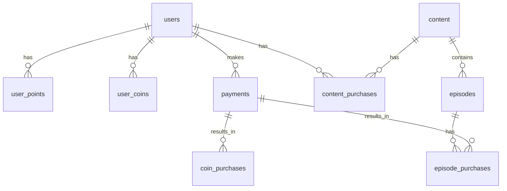

# BIND 데이터베이스 설계 및 설정

## 목차
- [데이터 저장소 전략](#데이터-저장소-전략)
- [ERD](#erd)
- [테이블 정의](#테이블-정의)
- [인덱스 전략](#인덱스-전략)
- [파티셔닝 전략](#파티셔닝-전략)
- [마이그레이션](#마이그레이션)
- [백업 정책](#백업-정책)
- [모니터링](#모니터링)
- [성능 최적화](#성능-최적화)

## 데이터 저장소 전략

### RDB (PostgreSQL)
주로 정규화가 필요한 핵심 비즈니스 데이터 저장

#### 주요 데이터
1. 사용자 정보
   - 회원 기본 정보
   - 포인트/코인 내역
   - 구매 이력

2. 콘텐츠 메타데이터
   - 작품 정보
   - 에피소드 정보
   - 가격 정보

3. 결제 정보
   - 결제 내역
   - 환불 정보
   - 정산 데이터

### NoSQL (MongoDB)
비정형 데이터나 자주 변경되는 데이터 저장

#### 주요 데이터
1. 사용자 활동 로그
   - 조회 이력
   - 검색 기록
   - 선호 장르

2. 콘텐츠 통계
   - 조회수
   - 좋아요 수
   - 댓글 수

3. 설정 데이터
   - UI 설정
   - 알림 설정
   - 뷰어 설정

### Cache (Redis)
빠른 조회가 필요한 임시 데이터 저장

#### 주요 데이터
1. 세션 데이터
   - 로그인 토큰
   - 사용자 세션

2. 실시간 데이터
   - 실시간 인기 작품
   - 최근 본 작품
   - 장바구니

3. 임시 데이터
   - 결제 진행 정보
   - OTP 코드
   - 이메일 인증 코드

### 검색 엔진 (Elasticsearch)
전문 검색이 필요한 데이터 저장

#### 주요 데이터
1. 콘텐츠 검색
   - 제목
   - 작가
   - 태그
   - 줄거리

2. 통합 검색
   - 공지사항
   - FAQ
   - 이벤트

### 파일 저장소 (S3)
바이너리 데이터 저장

#### 주요 데이터
1. 콘텐츠 파일
   - 이미지
   - 텍스트 파일
   - 미리보기 이미지

2. 사용자 업로드
   - 프로필 이미지
   - 리뷰 이미지

## ERD


## 테이블 정의

### users (사용자)
| Column | Type | Constraints | Description |
|--------|------|-------------|-------------|
| id | uuid | PK | 사용자 ID |
| email | varchar(255) | UNIQUE, NOT NULL | 이메일 |
| password | varchar(255) | NOT NULL | 암호화된 비밀번호 |
| name | varchar(50) | NOT NULL | 이름 |
| phone | varchar(20) | UNIQUE | 전화번호 |
| birth_date | date | NOT NULL | 생년월일 |
| is_adult_verified | boolean | DEFAULT false | 성인인증 여부 |
| status | varchar(20) | DEFAULT 'active' | 상태(active/inactive/suspended) |
| created_at | timestamp | NOT NULL | 생성일시 |
| updated_at | timestamp | NOT NULL | 수정일시 |

### user_points (포인트)
| Column | Type | Constraints | Description |
|--------|------|-------------|-------------|
| id | uuid | PK | 포인트 내역 ID |
| user_id | uuid | FK(users) | 사용자 ID |
| amount | integer | NOT NULL | 포인트 금액 |
| type | varchar(20) | NOT NULL | 유형(earn/use/expire) |
| description | text | | 설명 |
| expires_at | timestamp | | 만료일시 |
| created_at | timestamp | NOT NULL | 생성일시 |

### user_coins (코인)
| Column | Type | Constraints | Description |
|--------|------|-------------|-------------|
| id | uuid | PK | 코인 내역 ID |
| user_id | uuid | FK(users) | 사용자 ID |
| amount | integer | NOT NULL | 코인 수량 |
| type | varchar(20) | NOT NULL | 유형(purchase/use/gift) |
| description | text | | 설명 |
| created_at | timestamp | NOT NULL | 생성일시 |

[이하 다른 테이블들도 동일한 형식으로 정의...]

## 인덱스 전략

### 성능 중요 쿼리
1. 사용자 로그인 조회
```sql
CREATE INDEX idx_users_email ON users(email);
```

2. 결제 내역 조회
```sql
CREATE INDEX idx_payments_user_created ON payments(user_id, created_at DESC);
```

3. 콘텐츠 검색
```sql
CREATE INDEX idx_content_title ON content USING gin(to_tsvector('korean', title));
```

### 인덱스 관리
- 분기별 인덱스 사용량 모니터링
- 미사용 인덱스 제거
- 정기적인 VACUUM ANALYZE 수행

## 파티셔닝 전략

### 파티셔닝 대상 테이블
1. payments
   - 월별 파티셔닝
   - 3개월 이전 데이터는 콜드 스토리지로 이동

2. user_points
   - 사용자 ID 범위 기반 파티셔닝
   - 만료된 포인트는 별도 테이블로 이동

3. content_views
   - 일별 파티셔닝
   - 7일 이전 데이터는 집계 후 삭제

## 마이그레이션

### 마이그레이션 원칙
1. 무중단 배포 가능해야 함
2. 롤백 계획 필수
3. 데이터 정합성 검증 필요

### 마이그레이션 절차
1. 마이그레이션 파일 생성
```bash
npm run migration:create -- -n CreateUsersTable
```

2. 마이그레이션 코드 작성
```typescript
export class CreateUsersTable implements MigrationInterface {
    public async up(queryRunner: QueryRunner): Promise<void> {
        // 테이블 생성 코드
    }

    public async down(queryRunner: QueryRunner): Promise<void> {
        // 롤백 코드
    }
}
```

3. 마이그레이션 실행 및 검증
```bash
npm run migration:run
npm run migration:show  # 상태 확인
```

## 백업 정책

### 백업 종류
1. 전체 백업
   - 매일 새벽 3시
   - AWS S3에 저장
   - 2주간 보관

2. 증분 백업
   - 6시간 간격
   - WAL 아카이브
   - 3일간 보관

3. 논리적 백업
   - 주 1회
   - pg_dump 사용
   - 1개월 보관

### 복구 절차
1. 가장 최근 전체 백업 복원
2. WAL 적용하여 특정 시점까지 복구
3. 데이터 정합성 검증

## 모니터링

### 모니터링 항목
1. 성능 지표
   - 쿼리 실행 시간
   - 인덱스 사용률
   - 캐시 히트율
   - 디스크 사용량

2. 알림 설정
   - CPU 사용률 80% 이상
   - 디스크 사용률 85% 이상
   - 복제 지연 5분 이상
   - 장기 실행 쿼리 발생

### 모니터링 도구
- AWS RDS Enhanced Monitoring
- pgAdmin
- pg_stat_statements
- Datadog

## 성능 최적화

### 쿼리 최적화
1. EXPLAIN ANALYZE 활용
2. 실행 계획 분석
3. 쿼리 재작성

### 설정 최적화
```conf
# Memory
shared_buffers = 4GB
work_mem = 32MB
maintenance_work_mem = 512MB

# Checkpoints
checkpoint_timeout = 15min
max_wal_size = 2GB

# Query Planning
random_page_cost = 1.1
effective_cache_size = 12GB
```

### 주기적 유지보수
1. VACUUM FULL
2. 테이블/인덱스 재구성
3. 통계 정보 갱신 